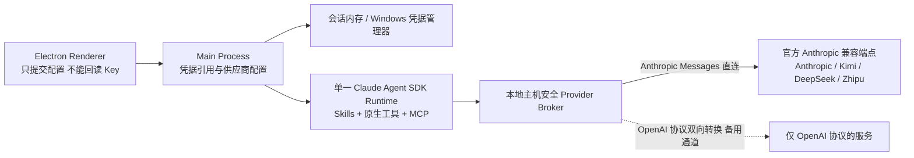
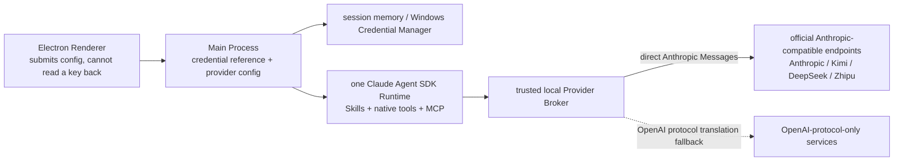

# Mental LEGOs · 心智乐高

[中文](#中文) | [English](#english)

## 中文

心智乐高（Mental LEGOs）是一个本地优先的训练系统，帮助用户把个人知识、经验和专业判断转化为可复用的口头表达模块（语言乐高），并在有时间压力或评价压力时快速调用和重新组合。

产品目标不是让 AI 代替用户回答，而是帮助用户建立真正属于自己的语言——**不再从零思考表达，拼装你的认知积木**——使其能够在面试、会议、谈判、客户沟通、专业演讲和现场问答中自然调用。

### 当前版本

**0.2.1**（定档标签 `v0.2.1`——评测驱动的修复与真机走查：画像观察的完整生命周期、相似积木合并、以及一轮全量评测查出的模型下线与判分缺陷；上一定档为 `v0.2.0`）。

### 下载与安装

暂无公开发布渠道，需从源码构建。

**环境要求**

- Windows 10 / 11（x64）
- Node.js ≥ 22 与 npm

**构建安装包**

```bash
git clone https://github.com/juicykwok2019/Mental-LEGOs.git
cd Mental-LEGOs
npm install
npm run make
```

产物位于 `out/make/`：

| 产物 | 说明 |
| --- | --- |
| `squirrel.windows/x64/Mental LEGOs-<版本> Setup.exe` | 双击安装，装至 `%LocalAppData%\mental_legos`；卸载走 Windows「设置 → 应用」 |
| `zip/win32/x64/Mental LEGOs-win32-x64-<版本>.zip` | 免安装便携版 |

**首次使用**

1. 填写三句话专业画像（换设备迁移可改用引导页的「从加密备份恢复」）；
2. 进入「设置」，下载离线 Bash 运行时与本地语音模型（均逐文件校验）；
3. 配置自己的模型 API Key（BYOK，支持 Anthropic / Kimi / DeepSeek / 智谱预置或自定义端点）；
4. 回到「今天练」，开始第一轮训练。

用户数据存于 `%APPDATA%\Mental LEGOs`，全程本机，不上传。

### 项目状态

截至 2026-08-18，PRD 规划的四个阶段在单机可行范围内**已全部交付**。完整训练闭环已在真实 Provider（Kimi 开放平台官方 Anthropic 端点）上端到端验证，全部新增攻击面经过安全审查。

**已交付功能一览**：

- **今天练**——基于你的画像出题，先自己答、后得辅助；诊断只引用你的原话，提示逐级给；可无限复练、满意才提炼积木；换问法检验迁移，按掌握度安排复现；
- **场景**——导入 JD、简历等材料（PDF / Word / 文本 / 录音），生成针对性问题逐题训练，事后复盘沉淀场景积木；
- **演讲**——每遍试讲给实测数据（时长 / 语速 / 停顿），用自己的积木组装讲稿骨架，可压缩、扩展、换听众；
- **积木库**——模块 = 语义内核 + 逻辑骨架 + 语言外壳 + 触发线索；支持编辑、版本、关系（组合出题、相似合并）与分层删除；
- **个人底座**——系统对你的全部了解：画像观察逐条复核（确认 / 驳回）、知识沉淀与缺口，可查可删；
- **本地语音**——SenseVoice 本机转写，录音随处可回放自评，音频不出设备；
- **隐私**——字段级加密落盘、分层删除、口令加密导出、换设备恢复、原始用量展示；
- **模型接入**——BYOK；Anthropic / Kimi / DeepSeek / 智谱官方兼容端点预置 + 自定义，配真实能力认证。

细节（训练闭环、粒度规则、安全边界）见下文各节与 `docs/`。

**已知限制**

- 云端语音（火山引擎）暂未接入，本地语音不受影响；
- 安装包尚未在全新 Windows 环境上完成验证，遇安装问题请提 Issue。

**路线图（后续版本）**

- 系统化评测体系（设计见 [`docs/evaluation-plan.md`](docs/evaluation-plan.md)）；
- 云端语音接入、公开演讲视频分析；
- 跨设备同步、Web / 移动伴随端、可信评审者反馈。

### 核心理念

一块语言乐高比完整背稿更小，又比孤立句子更有意义。每块模块包含：

1. **语义内核**——需要保持稳定的判断、事实或观点；
2. **逻辑骨架**——解释这一观点时可以复用的展开顺序；
3. **语言外壳**——用户愿意并能够自然说出口的一种或多种表达方式（提炼时强制复用用户原话）；
4. **触发线索**——听到什么样的问题应该唤起这块积木。

完整回答由多块模块组合而成，例如：

```text
争取思考时间模块
  + 问题收敛模块
  + 核心观点模块
  + 证据或个人案例模块
  + 边界或质疑回应模块
  + 总结模块
= 一次可灵活调整的口头回答
```

系统以问题为驱动，而不是以句子为驱动：它训练的是新问题与相应知识、结构和语言之间的调用关系。北极星指标是**无提示调用成功率**——换一种问法之后，用户还能不能把自己的积木说出来。

### 训练闭环

```text
开放式问题
  → 第一次无辅助语音回答（包括"暂时答不出来"）
  → 基于回答证据的诊断
  → 最小必要提示
  → 第二次回答
  → 提炼并由用户编辑、确认语言乐高
  → 改变问法检验迁移
  → 间隔复现与现实场景复盘
```

用户永远先完成第一次尝试，随后才会看到诊断与提示；系统在任何环节都不提供答案、完整提纲或可直接照读的表达。辅助逐级提供，并随调用能力提高逐步撤除。

### 技术形态

- Windows 优先的 Electron 桌面应用，单用户、本地优先，无 SaaS 后端；
- 本地 SQLite（字段级加密）与文件系统保存结构化数据、材料、录音和派生产物；
- 用户自备模型密钥（BYOK）；本地语音识别默认，云端语音需逐场景显式选择（未接入）；
- 数据导出、保留和删除完全由用户控制。

### Agent 架构

核心 Agent Runtime 使用完整 Agent Loop 形态的 [Claude Agent SDK](https://code.claude.com/docs/en/agent-sdk/overview)，而不是把它包装成单次文本生成请求。

架构遵循以下约束：

- 日常训练、材料分析、场景准备、事后复盘和演讲训练由一个主 Agent 处理；宿主持有全部状态转换，Agent 只通过受治理的运行产出内容；
- 文件读写与编辑、Bash、代码执行、Skills、MCP、Hooks、权限和会话恢复等原生能力保留在隔离工作区内；
- Deep Research 是唯一计划允许显式启用临时子 Agent 的模式；
- 产品方法、评价量表、参考实现和可调整脚本存放在 Skills 中；
- 最小 MCP 治理内核保护数据作用域、来源、用户确认（含确认时的用户编辑合并）、正式持久化、训练事件、媒体访问、导出和删除；
- Agent 可以在当前会话工作区复制并调整 Skill 参考代码，但不能在运行时改写共享生产 Skills、MCP 服务、正式数据库或凭证存储；
- 不使用 LangGraph、LangChain、Dify 或手写状态图作为核心推理架构。

桌面架构分离 Electron Renderer、Preload Bridge、Main Process、Agent Runtime Worker、本地策略与数据 Broker 以及语音 Worker。Renderer 不能直接访问 Node.js、数据库、凭证、Shell 或不受限制的文件系统。

#### Provider 接入策略

预置服务只收录**官方提供 Anthropic 兼容端点、且条款允许第三方应用按量使用标准 API Key** 的产品，例如 Kimi 开放平台的官方 Anthropic 端点（`https://api.moonshot.cn/anthropic`，见[官方接入说明](https://platform.kimi.com/docs/guide/claude-code-kimi)）。面向编码工具的订阅制 Coding Key（如 Kimi Code）因官方将其限定为交互式编码用途且禁止篡改客户端标识，**不作为本产品的接入通道**。



OpenAI Chat Completions 本地转换器保留为备用通道，面向未来只有 OpenAI 协议的服务；协议转换只存在于受信任的 Provider 边界，转换器不是第二个 Agent。任何通道都必须通过相同的完整 Provider 能力认证，不能降级成普通聊天调用。应用始终如实发送自身客户端标识，不伪装成其他工具。

### 隐私与安全

专业材料、录音、转写、个人画像和 API 凭证默认都属于敏感数据。

- 产品数据保留在用户设备上，除非用户主动调用外部模型、语音供应商或研究服务；
- 使用云端处理前，必须清楚披露供应商信息并由用户主动选择；
- API Key 保存在操作系统安全凭证存储或会话内存中，绝不进入 Agent 工作区、日志、导出文件或 Git；
- Agent 只接收当前会话经过授权的材料副本或片段（长材料按摘录窗口截断并向用户披露）；它不会扫描用户电脑，也不能直接打开正式数据库；
- 候选事实、画像观察和语言模块必须经过用户确认（可先编辑），才能成为正式资产；
- 破坏性操作必须先展示影响范围，再获得用户明确确认；每次删除记入确认事件，可审计。

### 开发与验证

面向修改代码的开发者（安装包构建见上文"下载与安装"）：

```bash
npm start                      # 开发运行，免打包（主进程改动需手动重启 Electron）
npm run check                  # typecheck + lint + 测试 + 架构守卫 + Skill 校验 + 隐私扫描
npm run package && npm run probe:packaged:windows   # 打包形态冒烟验证
```

更多约定见 [`docs/dev-workflow-notes.md`](docs/dev-workflow-notes.md)。

### 仓库隐私

本仓库始终按照"每个提交未来都可能公开"的标准维护。个人材料、录音、转写、凭证、真实客户数据、私密产品研究和其他机密输入绝不能进入 Git。

示例和测试数据必须使用合成数据或明确公开的数据。私密产品文档与本地用户材料仅保存在 Git 忽略的目录中。

### 许可证

版权所有 © 2026 Mental LEGOs 项目作者，保留所有权利（All Rights Reserved）。本仓库暂未采用开源许可证：在获得明确书面授权前，不授予复制、修改、分发或商用本代码的许可。第三方组件的许可声明见 `resources/licenses/`。

---

## English

Mental LEGOs (心智乐高) is a local-first training system for turning personal knowledge, experience, and professional judgment into reusable spoken-language modules that can be recalled and recombined under time or evaluation pressure.

The goal is not to let AI answer on the user's behalf. It is to help the user build language that becomes genuinely available in interviews, meetings, negotiations, client conversations, professional presentations, and live Q&A — never thinking from zero again, assembling your own cognitive bricks instead.

### Current version

**0.2.1** (tag `v0.2.1` — evaluation-driven fixes and live walkthroughs: the full lifecycle for profile observations, merging similar bricks, and the retired-model and scoring defects a full evaluation round turned up; the previous milestone was `v0.2.0`).

### Download and install

No public release channel yet — build from source.

**Requirements**

- Windows 10 / 11 (x64)
- Node.js ≥ 22 with npm

**Build the installer**

```bash
git clone https://github.com/juicykwok2019/Mental-LEGOs.git
cd Mental-LEGOs
npm install
npm run make
```

Artifacts land in `out/make/`:

| Artifact | Notes |
| --- | --- |
| `squirrel.windows/x64/Mental LEGOs-<version> Setup.exe` | Double-click to install into `%LocalAppData%\mental_legos`; uninstall via Windows Settings → Apps |
| `zip/win32/x64/Mental LEGOs-win32-x64-<version>.zip` | Portable build, no installation |

**First run**

1. Fill in the three-sentence professional profile (or use "restore from encrypted backup" on the onboarding screen when migrating devices);
2. In Settings, download the offline Bash runtime and the local speech model (both per-file verified);
3. Configure your own model API key (BYOK — Anthropic / Kimi / DeepSeek / Zhipu presets or a custom endpoint);
4. Head back to Today and start your first round.

User data lives in `%APPDATA%\Mental LEGOs` — entirely on-device, never uploaded.

### Status

As of 2026-08-18 all four PRD phases are **delivered within single-machine scope**. The full training loop is verified end to end against a real provider (the Kimi Open Platform official Anthropic endpoint), and every newly added attack surface has passed a security review.

**Shipped features at a glance**:

- **Today** — profile-grounded questions; answer first, get help after; diagnosis quotes only your own words, hints escalate gradually; rehearse as often as you like and extract bricks only when satisfied; changed-question transfer checks feed mastery-based scheduling;
- **Scenarios** — import materials (PDF / Word / text / audio), generate targeted questions, train them one by one, then review the real event into scenario bricks;
- **Speech** — every rehearsal gets measured stats (duration / pace / pauses); assemble a speech skeleton from your own bricks, then compress, expand, or re-frame it for a new audience;
- **Brick library** — a module is kernel + skeleton + shells + triggers; edit, version, relate (composition questions, similar-merge), and delete in layers;
- **Personal foundation** — everything the system knows about you: review each observation (confirm / reject), browse and prune the knowledge base and gaps;
- **Local speech** — SenseVoice on-device transcription; recordings replay anywhere for self-review; audio never leaves the device;
- **Privacy** — field-level encryption at rest, layered deletion, password-sealed export, cross-device restore, raw usage display;
- **Providers** — BYOK; Anthropic / Kimi / DeepSeek / Zhipu official presets plus custom endpoints, with real capability certification.

Details (the training loop, granularity rules, security boundaries) follow below and in `docs/`.

**Known limitations**

- Cloud speech (Volcano Engine) is not yet integrated; local speech is unaffected;
- The installer has not yet been verified on a pristine Windows machine — please file an issue if installation misbehaves.

**Roadmap**

- A systematic evaluation harness (design in [`docs/evaluation-plan.md`](docs/evaluation-plan.md));
- Cloud speech integration and public-speaking video analysis;
- Cross-device sync, web / mobile companions, trusted-reviewer feedback.

### The core idea

A language LEGO is smaller than a memorized answer and more meaningful than an isolated sentence. Each module has:

1. **Semantic kernel** — the judgment, fact, or idea that should remain stable;
2. **Logical skeleton** — the reusable order in which the idea is explained;
3. **Language shell** — one or more natural ways the user is comfortable saying it aloud (extraction is required to reuse the user's own wording);
4. **Triggers** — the kinds of questions that should recall this brick.

Complete answers are assembled from multiple modules, for example:

```text
thinking-time module
  + question-scoping module
  + core-viewpoint module
  + evidence or personal-case module
  + limitation or objection module
  + conclusion module
= one adaptable spoken response
```

The system is question-driven rather than sentence-driven: it trains the connection between a new prompt and the knowledge, structure, and language that should be recalled. The north-star metric is **unprompted recall** — after the question changes, can the user still say their own bricks aloud?

### Training loop

```text
open question
  → first unaided voice response (including "I cannot answer yet")
  → evidence-based diagnosis
  → minimum necessary hint
  → second response
  → user-edited, user-confirmed language LEGO extraction
  → changed-question transfer check
  → spaced recall and real-world review
```

The user always attempts the first response before receiving diagnosis or hints; the system never provides an answer, a full outline, or ready-to-read wording at any step. Assistance is introduced gradually and withdrawn as recall improves.

### Technical shape

- Windows-first Electron desktop application; single-user, local-first, no SaaS backend;
- Local SQLite (field-level encryption) and filesystem storage for structured data, materials, recordings, and derived artifacts;
- Bring your own key (BYOK); local speech recognition by default, cloud speech only by explicit per-scenario choice (not yet integrated);
- User-controlled export, retention, and deletion.

### Agent architecture

The core agent runtime uses the [Claude Agent SDK](https://code.claude.com/docs/en/agent-sdk/overview) as a complete agent loop, not as a wrapper around a single text-generation request.

The architecture follows these constraints:

- One primary agent handles normal training, material analysis, scenario preparation, retrospective review, and public-speaking practice; the host owns every state transition, and the agent produces content only through governed runs;
- Native capabilities such as file reading and editing, Bash, code execution, Skills, MCP, hooks, permissions, and session recovery remain available inside an isolated workspace;
- Deep Research is the only planned mode that may explicitly enable temporary sub-agents;
- Product methods, rubrics, reference implementations, and adaptable scripts live in Skills;
- A small MCP governance kernel protects scoped data access, provenance, user confirmation (including user edits merged at commit), formal persistence, practice events, media access, export, and deletion;
- The agent may copy and adapt Skill reference code inside a session workspace, but it cannot rewrite shared production Skills, MCP services, the formal database, or credential storage at runtime;
- LangGraph, LangChain, Dify, and hand-written state graphs are not used as the core reasoning architecture.

The desktop architecture separates the Electron renderer, preload bridge, main process, agent runtime worker, local policy/data broker, and speech worker. The renderer has no direct Node.js, database, credential, Shell, or unrestricted filesystem access.

#### Provider access policy

Preset providers are limited to products that expose an **official Anthropic-compatible endpoint** and whose terms allow third-party applications with pay-as-you-go standard API keys — for example the Kimi Open Platform official Anthropic endpoint (`https://api.moonshot.cn/anthropic`, see the [official guide](https://platform.kimi.com/docs/guide/claude-code-kimi)). Subscription coding keys such as Kimi Code are **not supported**: their vendors restrict them to interactive coding use and forbid client-identity spoofing.



The local OpenAI Chat Completions adapter remains a fallback for future providers that only speak the OpenAI protocol. Translation exists only at the trusted provider boundary and the adapter is not a second Agent. Every route must pass the same full provider capability certification and may not degrade into ordinary chat-only API use. The application always sends its own client identity and never impersonates another tool.

### Privacy and security

Professional materials, recordings, transcripts, personal profiles, and API credentials are sensitive by default.

- Product data remains on the user's device unless the user deliberately invokes an external model, speech provider, or research service;
- Cloud processing requires a clear provider disclosure and explicit user choice;
- API keys are kept in operating-system-backed credential storage or session memory, never in the agent workspace, logs, exports, or Git;
- The agent only receives authorized copies or excerpts in a per-session workspace (long materials are excerpted with the window disclosed to the user); it does not scan the user's computer or directly open the formal database;
- User confirmation (with optional editing) is required before candidate facts, profile observations, or language modules become formal assets;
- Destructive actions require a preview and explicit confirmation; every deletion is recorded as an auditable consent event.

### Develop and verify

For contributors changing the code (installer builds are covered in "Download and install" above):

```bash
npm start                      # dev run, no packaging (main-process changes need a manual Electron restart)
npm run check                  # typecheck + lint + tests + architecture guard + skill manifest + privacy scan
npm run package && npm run probe:packaged:windows   # packaged-form smoke verification
```

More conventions in [`docs/dev-workflow-notes.md`](docs/dev-workflow-notes.md).

### Repository privacy

This repository is maintained as if every commit may eventually become public. Personal materials, recordings, transcripts, credentials, real client data, private product research, and other confidential inputs must never be committed.

Examples and test fixtures must use synthetic or explicitly public data. Private product documents and local user materials are kept outside Git through ignored directories.

### License

Copyright © 2026 the Mental LEGOs project authors. All rights reserved. This repository has not adopted an open-source license: no permission to copy, modify, distribute, or commercially use this code is granted without explicit written authorization. Third-party component notices live in `resources/licenses/`.
