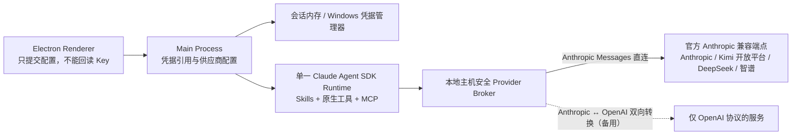
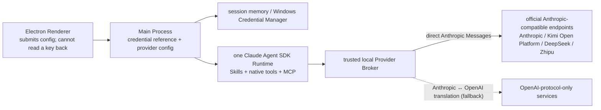

# Mental LEGOs

[中文](#中文) | [English](#english)

## 中文

Mental LEGOs 是一个本地优先的训练系统，帮助用户把个人知识、经验和专业判断转化为可复用的口头表达模块，并在有时间压力或评价压力时快速调用和重新组合。

产品目标不是让 AI 代替用户回答，而是帮助用户建立真正属于自己的语言，使其能够在面试、会议、谈判、客户沟通、专业演讲和现场问答中自然调用。

### 项目状态

项目目前处于 **Phase 0 架构验证阶段**，尚无公开版本，也还不是可用于正式训练的 P0 产品。

当前仓库已经实现并自动验证：

- 安全加固的 Electron Windows 桌面壳与受限 IPC；
- 以 Claude Agent SDK / Claude Code 为唯一核心 Agent Runtime 的单 Agent 循环；
- 隔离的原生 Read、Write、Edit、Bash、Python、Skill、MCP、Hooks 与会话恢复；
- 10 个可执行的产品 Skills 与最小 MCP 治理内核；
- 会话级或 Windows 凭据管理器保存的 BYOK Provider 配置，Renderer 不可回读密钥；
- 预置服务全部使用官方 Anthropic 兼容端点直连，并保留 OpenAI Chat Completions 本地适配通道作为备用；
- 两阶段真实 Provider 能力认证：先生成合成候选预览，用户确认后才签发一次性 token、恢复会话并写入，最后清除全部测试数据；
- 可下载、逐文件校验的离线 Bash / Coreutils / Python 运行时；
- 基于 SenseVoice / sherpa-onnx 的本地 ASR 运行时和模型管理基础设施；
- Windows 打包、安装、合成全链路、架构边界和隐私扫描测试。

2026-08-17 起项目进入 **Phase 1 开发**：完整 Agent 能力认证已在 Kimi 开放平台官方 Anthropic 端点（`kimi-k3` 与 `kimi-k2.5`）真实通过；加密正式数据层、治理资产物化桥、第一遍门禁训练引擎和 Chat 形态的完整训练闭环（真实端点端到端验证）已经落地。干净 Windows 环境验收、录音与本地 ASR 产品化、场景与演讲模式仍在进行中。

首个产品目标是使用 Electron 构建一款单用户 Windows 桌面应用。Web 和移动端可能在后续阶段扩展，但不属于第一版范围。

### 核心理念

一块语言乐高比完整背稿更小，又比孤立句子更有意义。每块模块包含三层：

1. **语义内核**——需要保持稳定的判断、事实或观点。
2. **逻辑骨架**——解释这一观点时可以复用的展开顺序。
3. **语言外壳**——用户愿意并能够自然说出口的一种或多种表达方式。

完整回答由多块模块组合而成，例如：

```text
争取思考时间模块
  + 问题收敛模块
  + 核心观点模块
  + 证据或个人案例模块
  + 边界或质疑回应模块
  + 总结模块
= 一次可灵活调整的口头回答
```

系统以问题为驱动，而不是以句子为驱动：它训练的是新问题与相应知识、结构和语言之间的调用关系。

### 训练闭环

```text
开放式问题
  → 第一次无辅助语音回答（包括“暂时答不出来”）
  → 基于回答证据的诊断
  → 最小必要提示
  → 第二次回答
  → 提炼并由用户确认语言乐高
  → 改变问法与组合训练
  → 间隔复现与现实场景复盘
```

用户永远先完成第一次尝试，随后才会看到答案、完整提纲或可直接照读的表达。辅助会逐级提供，并随着调用能力提高逐步撤除。

### 产品模式

同一套训练引擎支持三种首版模式：

- **日常开放训练**——系统根据已经确认的知识、现有模块和训练历史提出专业问题。
- **真实场景准备与复盘**——用户创建有明确边界的场景，加入经过授权的材料，训练可能出现的问题，并可在事后复盘经过授权的录音或转写。
- **专业公开演讲**——用户进行音频试讲，提炼可复用的开场、论点、故事、过渡、总结和问答模块，再改变时长与听众条件进行训练。

第一版聚焦专业口头交流，不覆盖日常闲聊、情绪支持、长篇写作、娱乐表演，也不提供真实面试或会议中的隐蔽实时答案提示。

### P0 产品方向

- Windows 优先的 Electron 桌面应用。
- 单用户、本地优先；P0 不需要多租户 SaaS 后端。
- 使用本地 SQLite 和文件系统保存结构化数据、材料、录音和派生产物。
- 用户自备模型密钥（BYOK）；P0 同时支持 Anthropic Messages 直连和经本地主机适配的 OpenAI Chat Completions。
- 默认使用本地语音识别，也可以由用户主动选择云端语音服务。
- P0 分析公开演讲音频；视频分析延后。
- 由用户控制数据导出、保留和删除。

### Agent 架构

核心 Agent Runtime 必须使用完整 Agent Loop 形态的 [Claude Agent SDK](https://code.claude.com/docs/en/agent-sdk/overview)，而不是把它包装成单次文本生成请求。

架构遵循以下约束：

- 日常训练、材料分析、场景准备、事后复盘和演讲训练由一个主 Agent 处理。
- 文件读写与编辑、Bash、代码执行、Skills、MCP、Hooks、权限和会话恢复等原生能力保留在隔离工作区内。
- Deep Research 是唯一计划允许显式启用临时子 Agent 的模式。
- 产品方法、评价量表、参考实现和可调整脚本存放在 Skills 中。
- 最小 MCP 治理内核保护数据作用域、来源、用户确认、正式持久化、训练事件、媒体访问、导出和删除。
- Agent 可以在当前会话工作区复制并调整 Skill 参考代码，但不能在运行时改写共享生产 Skills、MCP 服务、正式数据库或凭证存储。
- 不使用 LangGraph、LangChain、Dify 或手写状态图作为核心推理架构。

桌面架构会分离 Electron Renderer、Preload Bridge、Main Process、Agent Runtime Worker、本地策略与数据 Broker 以及语音 Worker。Renderer 不能直接访问 Node.js、数据库、凭证、Shell 或不受限制的文件系统。

#### Provider 接入策略

预置服务只收录**官方提供 Anthropic 兼容端点、且条款允许第三方应用按量使用标准 API Key** 的产品，例如 Kimi 开放平台的官方 Anthropic 端点（`https://api.moonshot.cn/anthropic`，见[官方接入说明](https://platform.kimi.com/docs/guide/claude-code-kimi)）。面向编码工具的订阅制 Coding Key（如 Kimi Code）因官方将其限定为交互式编码用途且禁止篡改客户端标识，**不作为本产品的接入通道**。



OpenAI Chat Completions 本地转换器保留为备用通道，面向未来只有 OpenAI 协议的服务；协议转换只存在于受信任的 Provider 边界，转换器不是第二个 Agent。任何通道都必须通过相同的完整 Provider 能力认证，不能降级成普通聊天调用。应用始终如实发送自身客户端标识，不伪装成其他工具。

### 隐私与安全方向

专业材料、录音、转写、个人画像和 API 凭证默认都属于敏感数据。

- 产品数据保留在用户设备上，除非用户主动调用外部模型、语音供应商或研究服务。
- 使用云端处理前，必须清楚披露供应商信息并由用户主动选择。
- API Key 必须保存在操作系统安全凭证存储或会话内存中，绝不进入 Agent 工作区、日志、导出文件或 Git。
- Agent 只接收当前会话经过授权的材料副本或片段；它不会扫描用户电脑，也不能直接打开正式数据库。
- 候选事实、画像观察和语言模块必须经过用户确认，才能成为正式资产。
- 破坏性操作必须先展示影响范围，再获得用户明确确认。

### 仓库隐私

本仓库始终按照“每个提交未来都可能公开”的标准维护。个人材料、录音、转写、凭证、真实客户数据、私密产品研究和其他机密输入绝不能进入 Git。

示例和未来测试数据必须使用合成数据或明确公开的数据。私密产品文档与本地用户材料仅保存在 Git 忽略的目录中。

---

## English

Mental LEGOs is a local-first training system for turning personal knowledge, experience, and professional judgment into reusable spoken-language modules that can be recalled and recombined under time or evaluation pressure.

The goal is not to let AI answer on the user's behalf. It is to help the user build language that becomes genuinely available in interviews, meetings, negotiations, client conversations, professional presentations, and live Q&A.

### Status

The project is currently in **Phase 0 architecture verification**. There is no public release, and it is not yet a usable P0 training product.

The repository now implements and automatically verifies:

- a hardened Electron Windows shell with constrained IPC;
- a single-agent loop whose only core Agent Runtime is Claude Agent SDK / Claude Code;
- isolated native Read, Write, Edit, Bash, Python, Skill, MCP, hook, and session-resume capabilities;
- ten executable product Skills and a minimal MCP governance kernel;
- BYOK provider setup backed by session memory or Windows Credential Manager, without renderer key readback;
- official Anthropic-compatible endpoints for every preset provider, with a local OpenAI Chat Completions adapter kept as a fallback route;
- two-stage real-provider certification: create a synthetic preview first, issue a one-time token and resume only after user confirmation, then purge all certification data;
- a downloadable and per-file-verified offline Bash / Coreutils / Python runtime;
- local SenseVoice / sherpa-onnx ASR runtime and model-management foundations; and
- Windows packaging, installation, synthetic end-to-end, architecture-boundary, and privacy-scan tests.

As of 2026-08-17 the project is in **Phase 1 development**: full Agent capability certification passed for real against the Kimi Open Platform official Anthropic endpoint (`kimi-k3` and `kimi-k2.5`), and the encrypted formal data layer, governance-asset materializer, first-attempt-gate training engine, and the complete chat-form training loop (verified end to end on the live endpoint) are in place. Clean-Windows acceptance, recording and local ASR productization, and the scenario and speaking modes are still in progress.

The initial product target is a single-user Windows desktop application built with Electron. Web and mobile clients are possible later extensions, not part of the first release.

### The core idea

A language LEGO is smaller than a memorized answer and more meaningful than an isolated sentence. Each module has three layers:

1. **Semantic kernel** — the judgment, fact, or idea that should remain stable.
2. **Logical skeleton** — the reusable order in which the idea is explained.
3. **Language shell** — one or more natural ways the user is comfortable saying it aloud.

Complete answers are assembled from multiple modules, for example:

```text
thinking-time module
  + question-scoping module
  + core-viewpoint module
  + evidence or personal-case module
  + limitation or objection module
  + conclusion module
= one adaptable spoken response
```

The system is question-driven rather than sentence-driven: it trains the connection between a new prompt and the knowledge, structure, and language that should be recalled.

### Training loop

```text
open question
  → first unaided voice response (including "I cannot answer yet")
  → evidence-based diagnosis
  → minimum necessary hint
  → second response
  → user-confirmed language LEGO extraction
  → changed-question and composition practice
  → spaced recall and real-world review
```

The user always attempts the first response before receiving an answer, full outline, or ready-to-read wording. Assistance is introduced gradually and withdrawn as recall improves.

### Product modes

The same training engine supports three initial modes:

- **Daily open practice** — the system asks professional questions based on confirmed knowledge, existing modules, and training history.
- **Real-scenario preparation and review** — the user creates a bounded scenario, adds authorized materials, practices likely questions, and can later review an authorized recording or transcript.
- **Professional public speaking** — the user practices an audio presentation, extracts reusable opening, argument, story, transition, conclusion, and Q&A modules, then rehearses them under changed time and audience constraints.

The first release is intended for professional spoken communication. It does not target casual chat, emotional support, long-form writing, entertainment performance, or covert real-time answer prompting during actual interviews and meetings.

### P0 product direction

- Windows-first Electron desktop application.
- Single-user and local-first; no multi-tenant SaaS backend is required for P0.
- Local SQLite and filesystem storage for structured data, materials, recordings, and derived artifacts.
- Bring your own key (BYOK); P0 supports both direct Anthropic Messages providers and OpenAI Chat Completions through a local host adapter.
- Local speech recognition by default, with optional user-selected cloud speech services.
- Audio-based public-speaking analysis in P0; video analysis is deferred.
- User-controlled export, retention, and deletion.

### Agent architecture

The core agent runtime is required to use the [Claude Agent SDK](https://code.claude.com/docs/en/agent-sdk/overview) as a complete agent loop, not as a wrapper around a single text-generation request.

The architecture follows these constraints:

- One primary agent handles normal training, material analysis, scenario preparation, retrospective review, and public-speaking practice.
- Native capabilities such as file reading and editing, Bash, code execution, Skills, MCP, hooks, permissions, and session recovery remain available inside an isolated workspace.
- Deep Research is the only planned mode that may explicitly enable temporary sub-agents.
- Product methods, rubrics, reference implementations, and adaptable scripts live in Skills.
- A small MCP governance kernel protects scoped data access, provenance, user confirmation, formal persistence, practice events, media access, export, and deletion.
- The agent may copy and adapt Skill reference code inside a session workspace, but it cannot rewrite shared production Skills, MCP services, the formal database, or credential storage at runtime.
- LangGraph, LangChain, Dify, and hand-written state graphs are not used as the core reasoning architecture.

The desktop architecture separates the Electron renderer, preload bridge, main process, agent runtime worker, local policy/data broker, and speech worker. The renderer has no direct Node.js, database, credential, Shell, or unrestricted filesystem access.

#### Provider access policy

Preset providers are limited to products that expose an **official Anthropic-compatible endpoint** and whose terms allow third-party applications with pay-as-you-go standard API keys — for example the Kimi Open Platform official Anthropic endpoint (`https://api.moonshot.cn/anthropic`, see the [official guide](https://platform.kimi.com/docs/guide/claude-code-kimi)). Subscription coding keys such as Kimi Code are **not supported**: their vendors restrict them to interactive coding use and forbid client-identity spoofing.



The local OpenAI Chat Completions adapter remains a fallback for future providers that only speak the OpenAI protocol. Translation exists only at the trusted provider boundary and the adapter is not a second Agent. Every route must pass the same full provider capability certification and may not degrade into ordinary chat-only API use. The application always sends its own client identity and never impersonates another tool.

### Privacy and security direction

Professional materials, recordings, transcripts, personal profiles, and API credentials are sensitive by default.

- Product data remains on the user's device unless the user deliberately invokes an external model, speech provider, or research service.
- Cloud processing requires a clear provider disclosure and explicit user choice.
- API keys must be kept in operating-system-backed credential storage or session memory, never in the agent workspace, logs, exports, or Git.
- The agent only receives authorized copies or excerpts in a per-session workspace; it does not scan the user's computer or directly open the formal database.
- User confirmation is required before candidate facts, profile observations, or language modules become formal assets.
- Destructive actions require a preview and explicit confirmation.

### Repository privacy

This repository is maintained as if every commit may eventually become public. Personal materials, recordings, transcripts, credentials, real client data, private product research, and other confidential inputs must never be committed.

Examples and future test fixtures must use synthetic or explicitly public data. Private product documents and local user materials are kept outside Git through ignored directories.
